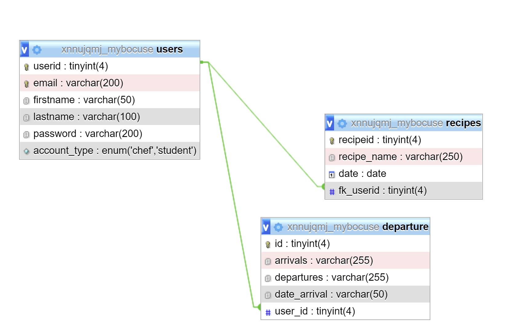

# Table of Content
* [Team](#Team)
* [Introduction](#Introduction)
* [Technologies](#Technologies)
* [Setup](#setup)
* [Improvements](#Improvements)
* [Contributing](#Contruting)
* [License](#License)

# Team

Our team members are:

- [Audrey Gilmant](https://github.com/GAudrey)
- [Dena Babaie](https://github.com/denababaie)
- [Richard Ibambasi](https://github.com/GuyRichardib)
- [Marie Fourriere](https://github.com/mariefourriere) 

# Introduction

Part of our becode training, we had to create a website. Here is the main instruction given:

>You have been selected to make a working prototype for the new cooking bootcamp of the Paul Bocuse Academy ("In Bocuse we trust"), a 7-months intensive cooking training with some of the best chefs around the world.
>One part of the training consists of a daily activity called "The Recette", each day at 1:30PM a learner choses one of his favorite recipe and shares it with the rest of the class.

Find our first attempt to a fullstack website [here](https://www.mariefourriere.go.yj.fr/)


# Technologies

* HTML
* JS
* CSS
* Bulma
* PHP
* SQL
* phpmyadmin
* Figma
* Trello
* Git hub


# Setup

### Github
We worked with github to share our codes. Find the repo [here](https://github.com/GuyRichardib/mybocuse).
```git
git init
git clone (url)
```
### Management
We used [Trello](https://trello.com/b/tKILIBwr/mybocus) to keep track of our work process and made mornings and afternoons briefs to stay aligned with the final objectives.

### Design
Our website design was made using Figma, click [here](https://www.figma.com/proto/1fpyLQdaZY3oKJFqO4uZoe/my.bocuse?node-id=11%3A6&scaling=scale-down) to view the prototype.

Here is an image of the database architecture.



# Improvements
We wish to improve:

* responsiveness
* home links have problems
* use of /includes are absent
* accessibility
* some features are missing in pages 
 
# Contributing
Pull requests are mandatory. Our team was asked to make commits and pull request often to keep track of everybody's work.

Please make sure to update tests as appropriate.

## License
[MIT](https://choosealicense.com/licenses/mit/)

## Disclaimer
<strong>Fair use disclaimer</strong> this website is for educational purposes only.
